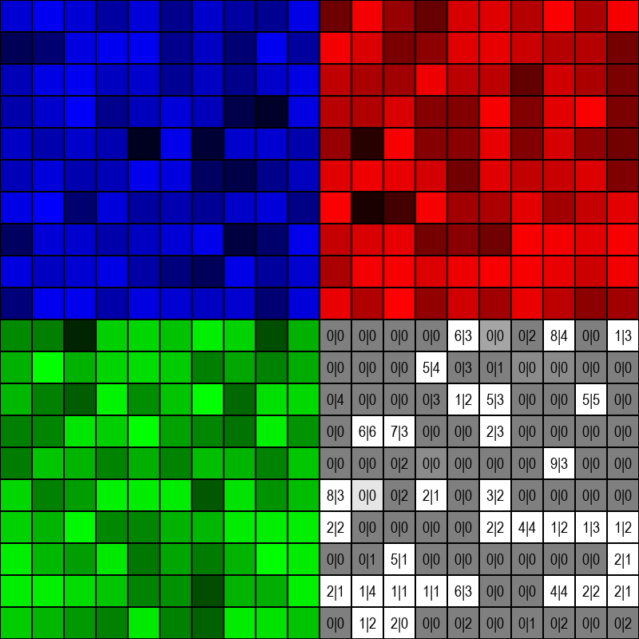

# Grasshopper Simulator

Grasshopper Simulator is a Python simulation made with [Pygame](https://www.pygame.org/) that emulates how grasshoppers with and without the ability to react to aggregation pheromones would live in a simulated environment.

Image of the simulation at runtime:



## Running the simulation
First, install the dependencies:
```bash
pip3 install pygame
```

Open the terminal in the project's main folder and run `main.py`through the Python interpreter:
```bash
python3 main.py
```

Outputs, which can be enabled or disabled through `settings.py`, are saved in the `images` folder and as `data.csv`. Those are all located in the root directory of the project.

## Simulation rules
- The simulation area is divided into a grid.
- Each cell corresponds to three attributes: attributes: resources (green), humidity (blue), and temperature (red). The brighter the color, the more the conditions are favorable for the grasshoppers.
- The grasshoppers will consume a fixed amount of resources from the cell they are in each turn, while the humidity and the temperature will randomly get more or less favorable. 
- If a grasshopper can receive and produce the aggregating pheromone and the condition of the cell is adequate, it will do so and all the nearby grasshoppers that are receptive will move toward the cell. Otherwise, they will randomly move in the adjacent cells until they find one with good enough conditions.
-  Every time a grasshopper moves it will have a certain probability of dying that is determined by the resources present in the cell and by the "predators" that will act more likely against smaller groups of grasshoppers. 

## How to read the plots
The grid is shown four times, one for each resource, humidity, and temperature and one for the number of grasshoppers. The grasshopper's cells will acquire a whiter color when aggregation pheromones are active and in each cell are displayed on the left the aggregating grasshoppers and on the right the non-aggregating ones.

## Tweaking the simulation parameters
You can alter the parameters of the simulation and its GUI in `settings.py`. 
Please refer to `settings.py` for a description of what each parameter does.